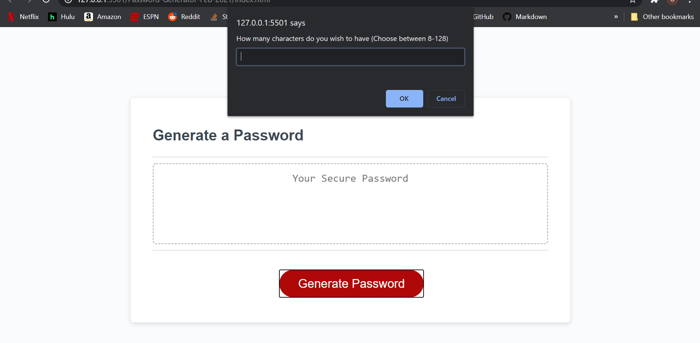
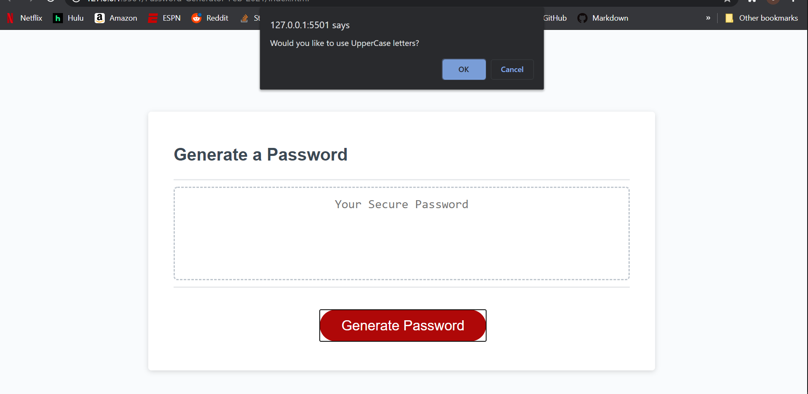
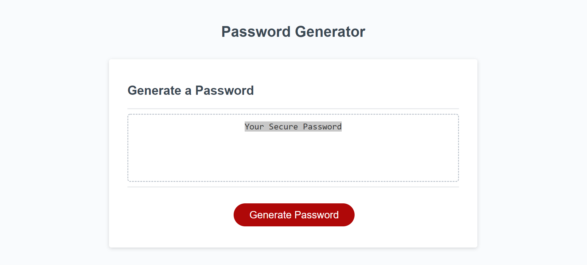

# Password-Generator-Feb-2021

## Functional Password Generator

In this project, I was commissioned to set up a password generator, using Prompt windows.  The password also needed to inculed options for upper and lower case letters, numbers, and symbols. This was a extremely difficult challenge for me.  While I understand the concepts of how JavaScript is layed out, I did not have a full understanding of how it held values to be used for later.  It was these concepts and had to learn outside of class, probably spending a total of 30-40 hours on this project.

### Code

In this project the HTML and CSS were given and I was required to build on the JavaScript file that was provided.

### Screenshots of Website

